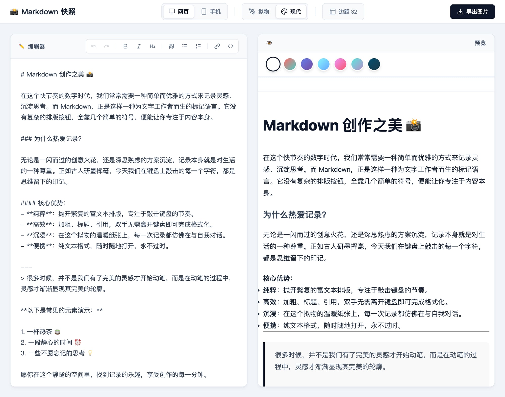

# 📸 Markdown Snap Extension

Chrome 浏览器扩展 - 监听复制 Markdown 内容，提供精美预览和导出

## 预览效果



## 功能特性

- ✅ **复制监听**：复制 Markdown 内容时自动弹窗提示预览
- ✅ **精美预览**：100% 复刻 [markdown-snap](https://github.com/houpe/markdown-snap) UI
- ✅ **双主题**：现代风格 / 拟物风格
- ✅ **双视图**：网页视图 / 手机视图
- ✅ **背景选择**：7 种预设背景渐变色
- ✅ **导出图片**：一键导出 PNG 图片
- ✅ **右键菜单**：选中文字右键直接预览

## 安装方法

### 方法一：开发者模式加载

1. 下载本项目到本地
2. 打开 Chrome，访问 `chrome://extensions/`
3. 开启右上角「开发者模式」
4. 点击「加载已解压的扩展程序」
5. 选择 `md-snap-extension` 文件夹

### 方法二：拖拽安装

直接将 `md-snap-extension` 文件夹拖到 Chrome 扩展页面

## 使用方法

### 自动检测

1. 在任意网页复制 Markdown 格式的文本
2. 自动弹出预览提示
3. 点击「预览」打开精美预览页面
4. 选择风格、视图、背景
5. 点击「导出图片」保存

### 手动输入

1. 点击浏览器工具栏的插件图标
2. 在输入框粘贴或输入 Markdown 内容
3. 点击「预览并导出」

### 右键菜单

1. 选中 Markdown 文本
2. 右键选择「📸 用 Markdown Snap 预览」

## 项目结构

```
md-snap-extension/
├── manifest.json      # 插件配置
├── background.js      # 后台服务（消息处理、右键菜单）
├── icons/             # 插件图标
└── src/
    ├── content/       # 内容脚本（监听复制）
    ├── popup/         # 弹窗界面
    └── preview/       # 预览页面
```

## 技术栈

- React 18
- TypeScript
- Vite
- react-markdown
- html-to-image

## 相关项目

- [markdown-snap](https://github.com/houpe/markdown-snap) - 原始 Web 应用

## License

MIT